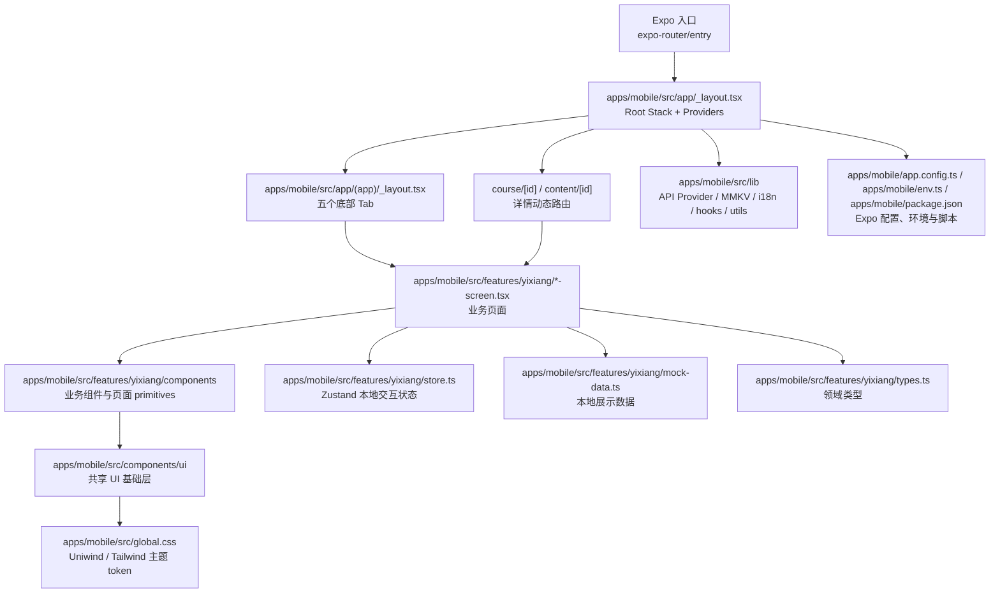

# 1 周 Expo React Native 速成路线

这份路线面向从 Web 前端转到移动端开发的人，目标不是泛读 Expo 文档，而是用 `颐享健康大讲堂` 这个项目建立可执行的移动端开发知识体系，并沉淀后续 vibe coding 的任务模板和验收标准。

默认节奏是 7 天，每天 1.5-2.5 小时。每天都按同一个闭环执行：

1. 读代码：只读当天相关的入口文件。
2. 建模型：用自己的话画出数据、导航、配置或 UI 链路。
3. 做练习：设计一个小改动或小功能。
4. 跑检查：用项目现有命令或手动 checklist 验收。
5. 写提示词：把练习沉淀成可交给 AI 的任务说明。

## 项目学习地图



优先理解这三个入口：

- `apps/mobile/src/app/_layout.tsx`：全局 Provider、Stack 路由、启动屏和错误边界。
- `apps/mobile/src/app/(app)/_layout.tsx`：五个底部 Tab，是当前原型的主导航壳。
- `apps/mobile/src/features/yixiang`：当前业务主战场，包含页面、组件、mock 数据、类型和 Zustand store。

## Day 1：Expo 心智模型

学习目标：知道 Expo 管什么，以及它和 React Native、原生 iOS/Android 工程的关系。

读代码：

- `apps/mobile/package.json`：重点看 `main`、`expo start`、`expo run:ios`、`expo run:android`、`eas build`、`prebuild`。
- `apps/mobile/app.config.ts`：重点看 app 名称、scheme、bundle id、plugins、字体、启动屏、图标。
- `apps/mobile/env.ts`：重点看 development、preview、production 环境如何生成配置。

需要建立的模型：

- `src` 代码由 Metro 打包。
- Expo dev server 把 JS bundle 提供给 Expo Dev Client、iOS Simulator、Android Emulator 或 Web。
- `apps/mobile/app.config.ts` 描述原生 app 能力和构建配置。
- Expo plugin 是修改原生配置的首选方式；不要优先手改 `ios/`、`android/`。
- `eas build` 是云端或远程构建生产包的路径，不等同于本地启动开发服务器。

练习：

- 画出“代码 -> Metro -> Expo Dev Client/Simulator -> 原生 App”的链路。
- 写 5 句话解释 `expo start`、`expo run:ios`、`prebuild`、`eas build`、`apps/mobile/app.config.ts` 的区别。

验收：

- 能解释为什么本项目规则要求优先改 Expo config 和 plugins。
- 能判断一个需求是纯 JS 需求，还是需要 Expo config/plugin/native capability。

## Day 2：Expo Router 与移动端导航

学习目标：掌握本项目的文件路由、Stack、Tabs、动态路由和页面边界。

读代码：

- `apps/mobile/src/app/_layout.tsx`：Root Stack 如何注册 `(app)`、`course/[id]`、`content/[id]`。
- `apps/mobile/src/app/(app)/_layout.tsx`：底部 Tab 如何注册首页、直播、健康、题库、我的。
- `apps/mobile/src/app/(app)/*.tsx`：这些文件为什么只是 re-export 业务页面。
- `apps/mobile/src/features/yixiang/course-detail-screen.tsx`、`content-detail-screen.tsx`：如何读取动态路由参数。

需要建立的模型：

- `apps/mobile/src/app` 是路由壳，不承载复杂业务。
- `apps/mobile/src/features/yixiang` 是业务实现层。
- 新增 Tab 是改 `(app)/_layout.tsx` 和对应 tab 路由。
- 新增详情页是新增动态路由入口，并在业务页面中用 `router.push` 跳转。

练习：

- 只写任务说明，不实现代码：设计一个“健康百科详情”入口。
- 任务说明必须包含路由位置、跳转来源、参数名、页面放在哪个 feature、mock 数据如何查找。

验收：

- 能向 AI 清楚区分“新增一个 tab 页面”和“新增一个详情页”。
- 能说明什么代码应放在 `apps/mobile/src/app`，什么代码应放在 `apps/mobile/src/features/yixiang`。

## Day 3：React Native UI 与 Web 差异

学习目标：理解 RN 没有 DOM 和 CSS cascade 后，布局、文本、滚动、安全区要怎么做。

读代码：

- `apps/mobile/src/features/yixiang/components/primitives.tsx`：`Screen`、`PageScroll`、`SerifText`、`Pill`、`ProgressLine`。
- `apps/mobile/src/components/ui/index.tsx`：项目如何导出基础 RN 组件。
- `apps/mobile/src/global.css`：Uniwind/Tailwind token 和颐享主题色。
- 任一 `*-screen.tsx`：观察页面如何组合 `Screen`、`PageScroll`、业务卡片和按钮。

需要建立的模型：

- RN 核心组件是 `View`、`Text`、`ScrollView`、`Pressable`、`SafeAreaView`。
- 移动端页面要明确处理安全区、底部 tab 高度、滚动容器、触控面积和中文长文本。
- Uniwind className 提供样式便利，但关键根容器仍保留显式 `StyleSheet` fallback。
- `primitives` 是本 feature 的轻量设计系统；`apps/mobile/src/components/ui` 是跨 feature 基础组件。

练习：

- 为任一页面设计一个新卡片，只写设计说明。
- 说明卡片状态、空态、长标题处理、按钮触控区域、是否需要抽成业务组件。

验收：

- 能判断一个移动端 UI 需求应落在页面内、`apps/mobile/src/features/yixiang/components`，还是 `apps/mobile/src/components/ui`。
- 能列出 UI 改动后必须手动检查的移动端问题：安全区、滚动、底部遮挡、文本溢出、平台字体。

## Day 4：本地状态、Mock 数据与未来 API 边界

学习目标：知道 Zustand、mock 数据、领域类型、React Query 各自负责什么。

读代码：

- `apps/mobile/src/features/yixiang/store.ts`：预约、收藏、答题锁定、直播筛选如何管理。
- `apps/mobile/src/features/yixiang/mock-data.ts`：原型展示数据如何组织。
- `apps/mobile/src/features/yixiang/types.ts`：领域类型如何约束页面和数据。
- `apps/mobile/src/lib/api/provider.tsx`、`apps/mobile/src/lib/api/client.tsx`：React Query 和 Axios 基础设施。

需要建立的模型：

- 当前原型展示数据来自 mock。
- 当前原型交互状态放 Zustand。
- 未来接真实 API 前，先设计 typed boundary，保留 mock 数据可运行。
- React Query 更适合服务端数据缓存、加载、错误和刷新；Zustand 更适合本地 UI/交互状态。

练习：

- 设计“收藏列表页”的数据流，不实现代码。
- 写清楚：数据来自哪些 mock，状态读哪个 store 字段，空态是什么，未来接 API 时 boundary 如何保留。

验收：

- 能解释 server state 和 client UI state 的边界。
- 能判断新增字段应放在 `types.ts`、`mock-data.ts`、`store.ts`，还是 `apps/mobile/src/lib/api`。

## Day 5：移动端平台能力与 Expo 插件

学习目标：理解 Expo 如何把 JS 项目连接到原生平台能力。

读代码：

- `apps/mobile/app.config.ts`：`expo-splash-screen`、`expo-font`、`expo-localization`、`app-icon-badge`、`react-native-edge-to-edge`。
- `apps/mobile/env.ts`：不同环境的 bundle id、package、scheme。
- `apps/mobile/src/lib/storage.tsx`：MMKV 本地存储。
- `apps/mobile/src/lib/hooks/use-selected-theme.tsx`：主题偏好如何落到本地存储。

需要建立的模型：

- 字体、启动屏、图标、深链 scheme、bundle id、权限、系统 UI 这类能力通常从 Expo config/plugin 入口处理。
- 环境差异必须通过配置集中管理，不要散落在页面代码里。
- 本地持久化用 MMKV；临时页面交互状态不一定需要持久化。

练习：

- 写出 development、preview、production 三个环境的配置差异说明。
- 为一个假想需求“增加相册上传封面图”判断：需要哪些 Expo API、权限、配置、UI 验收。

验收：

- 能判断一个需求是否需要改 `apps/mobile/app.config.ts` 或新增 Expo plugin。
- 能解释 scheme、bundle id/package、app badge、API URL 的用途。

## Day 6：调试、测试、质量门禁

学习目标：建立移动端开发的固定验收流程。

读代码：

- `apps/mobile/package.json`：`lint`、`type-check`、`test`、`check-all`。
- `jest.config.js`、`jest-setup.ts`：测试环境基础配置。
- `apps/mobile/src/components/ui/*.test.tsx` 和 `apps/mobile/src/features/auth/components/login-form.test.tsx`：现有测试写法。

需要建立的模型：

- 静态检查负责发现类型、规则和结构问题。
- Jest/React Testing Library 负责组件和交互级别回归。
- iOS/Android 手动验收仍然重要，因为安全区、字体、滚动、键盘、触控反馈不能只靠静态检查。

固定命令：

```sh
corepack pnpm run lint
corepack pnpm run type-check
corepack pnpm test --runInBand
```

UI 改动手动 checklist：

- 五个 tab 都能进入。
- 列表能滚动，并且底部内容不被 tab bar 遮挡。
- 中文标题、按钮、卡片正文不重叠、不溢出。
- 预约、收藏、直播筛选、答题锁定状态可用。
- iOS 安全区、底部导航、页面背景连续。

练习：

- 写一份“AI 完成 UI 任务后的验收报告模板”。

验收：

- 能发现并描述移动端常见问题：安全区、滚动、键盘遮挡、触控区域、平台字体。
- 能要求 AI 给出已运行检查、未运行检查、残余风险。

## Day 7：vibe coding 工作流固化

学习目标：把后续需求转化为 AI 能正确执行、你能正确验收的任务。

需要建立的模型：

- 先说业务目标，再说项目边界。
- 先定义数据与状态归属，再要求实现 UI。
- 路由入口、feature 位置、mock/type/store 变化必须写清楚。
- 验收必须包含命令检查和移动端手动 checklist。
- 明确禁止事项比事后返工便宜。

最终练习：

- 选一个小功能，例如“收藏列表页”或“课程详情页增加相关推荐”。
- 只让 AI 先给实现计划。
- 你审查：路由是否正确、状态边界是否正确、是否误接真实 API、是否破坏 tab-first flow、验收是否完整。

验收：

- 能读懂 AI 的实现是否破坏本项目架构。
- 能给出具体返工意见，而不是只说“再优化一下”。

## Vibe Coding 任务模板

```md
目标：在颐享健康大讲堂中实现/修改 XXX。

背景：
- 当前项目是 Expo React Native 原型。
- 主业务在 apps/mobile/src/features/yixiang。
- apps/mobile/src/app 只作为路由入口。

范围：
- 业务代码优先放在 apps/mobile/src/features/yixiang。
- 路由只在 apps/mobile/src/app 下做薄入口。
- 不引入真实登录、支付、直播 SDK、后端 API，除非明确说明。

数据与状态：
- 展示数据先放 mock-data.ts。
- 类型放 types.ts。
- 轻量交互状态放 store.ts。
- 服务端数据接入前先设计 typed boundary，并保持 mock 可用。

UI 约束：
- 使用 Screen 和 PageScroll。
- 保持暖色背景、黑色主文本、红棕强调色。
- 保证 iOS 安全区、滚动、底部 tab、中文长文本不出问题。
- 关键布局容器保留 React Native style fallback，不只依赖 className。

交互规则：
- 写清楚点击、禁用、空态、加载态、错误态。
- 写清楚本地状态是否需要持久化。

验收：
- 跑 corepack pnpm run lint。
- 跑 corepack pnpm run type-check。
- 跑 corepack pnpm test --runInBand。
- UI 改动需要检查五个 tab、滚动、交互状态和文本溢出。
```

## 三类常用提示词

### 新增页面

```md
请为颐享健康大讲堂新增 XXX 页面。

路由：
- 如果是 tab 页面，在 apps/mobile/src/app/(app) 下新增入口，并更新 tab layout。
- 如果是详情页，在 apps/mobile/src/app 下新增动态路由入口。
- apps/mobile/src/app 文件只 re-export feature screen，不写复杂业务。

业务实现：
- 页面实现放在 apps/mobile/src/features/yixiang。
- 新增类型放 types.ts。
- 新增 mock 放 mock-data.ts。
- 本地交互状态放 store.ts。

UI：
- 使用 Screen 和 PageScroll。
- 复用 features/yixiang/components 下的 primitives。
- 保持现有视觉方向，不引入新的设计体系。

请先给实现计划，再改代码；完成后说明检查结果和残余风险。
```

### 修改 UI

```md
请修改 XXX 页面/组件的 UI。

目标：
- 描述具体视觉和交互目标。

约束：
- 不改变路由结构。
- 不改变 mock 数据结构，除非确实需要。
- 保持暖色背景、黑色主文本、红棕强调色。
- 中文长文本必须不重叠、不溢出。
- iOS 安全区、滚动和底部 tab 不得被破坏。

验收：
- 说明修改了哪些屏幕。
- 跑 lint、type-check、test。
- 给出手动 UI checklist 的检查结论。
```

### 接入平台能力

```md
请评估并实现 XXX 移动端能力。

先判断：
- 是否已有 Expo API 支持。
- 是否需要修改 apps/mobile/app.config.ts。
- 是否需要 Expo plugin。
- 是否需要权限声明。
- 是否允许生成或修改 `apps/mobile/ios` / `apps/mobile/android` 原生目录。

实现约束：
- 优先使用 Expo config 和 plugins。
- 不直接手改 `apps/mobile/ios` / `apps/mobile/android`，除非得到明确授权。
- 配置差异通过 `apps/mobile/env.ts` / `apps/mobile/app.config.ts` 管理。

验收：
- 说明 iOS/Android/Web 支持差异。
- 说明权限、失败态和降级行为。
- 跑 lint、type-check、test。
```

## AI 验收报告模板

```md
完成内容：
- ...

架构边界：
- 路由入口：
- 业务实现位置：
- 数据来源：
- 状态归属：

已运行检查：
- corepack pnpm run lint：
- corepack pnpm run type-check：
- corepack pnpm test --runInBand：

手动 UI 检查：
- 五个 tab：
- 滚动与底部 tab：
- 中文文本：
- 预约/收藏/筛选/答题状态：

未完成或残余风险：
- ...
```

## 第一周之后的进阶主题

- Expo Updates 和 OTA 发布策略。
- EAS Build、证书、profile、应用商店发布。
- 原生模块、config plugin 编写和 prebuild 产物管理。
- 性能 profiling、列表性能、图片缓存、启动时间优化。
- 真实 API 接入、鉴权、错误处理、离线缓存。
- 移动端端到端测试，例如 Maestro。
